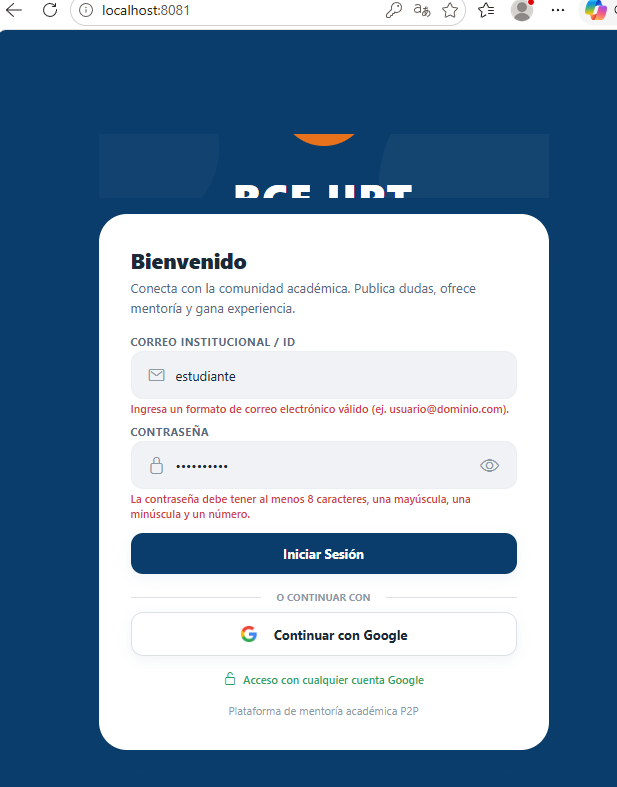
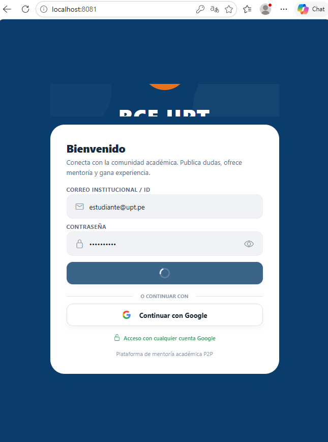

# 🎓 Red Colaborativa Estudiantil (RCE UPT)
> **"Democratizando el apoyo académico inmediato mediante el aprendizaje entre pares."**

RCE UPT es una plataforma integral diseñada para estudiantes universitarios que buscan resolver dudas académicas de forma rápida y organizada. Al conectar a estudiantes expertos con aquellos que necesitan ayuda, transformamos el campus en un ecosistema de apoyo mutuo.

---

## 📌 Información General

*   **Nombre del curso:** `Soluciones Moviles II`
*   **Nombre completo del alumno:** `Joan Cristian Medina Quispe`
*   **Código de estudiante:** `2022074255`
*   **Fecha:** `02/06/2026`
*   **URL del repositorio público:** [https://github.com/JMedina255/SM2_EXAMEN_VALIDACIONES](https://github.com/JMedina255/SM2_EXAMEN_VALIDACIONES)

---

## 🛠️ Detalle de la Implementación

### Pantalla Seleccionada
Se ha seleccionado y reestructurado la **Pantalla de Inicio de Sesión (`LoginScreen.js`)**. 
Para cumplir con los criterios de evaluación, se incorporó un formulario de inicio de sesión manual que convive con el botón de Google Sign-in original:
- Un campo de texto para **Correo Electrónico** con su correspondiente `keyboardType` optimizado y validación en tiempo real tras pulsar enviar.
- Un campo de texto para **Contraseña** con botón para alternar dinámicamente la visibilidad del texto (`secureTextEntry`).
- Los mensajes de error se renderizan directamente debajo de cada campo en color rojo al intentar realizar la autenticación si no cumple con las expresiones regulares definidas.

### Validaciones RegExp (Dart / JavaScript)
Dado que el proyecto base está construido con **React Native (Expo)** en JavaScript/TypeScript, las expresiones regulares fueron implementadas en JS. Sin embargo, a continuación se documentan tanto su equivalencia en Dart como su funcionamiento técnico:

#### 1. Correo Electrónico (Email)
- **Expresión Regular (JavaScript):** `/^[a-zA-Z0-9._%+-]+@[a-zA-Z0-9.-]+\.[a-zA-Z]{2,}$/`
- **Expresión Regular (Dart):** `RegExp(r"^[a-zA-Z0-9._%+-]+@[a-zA-Z0-9.-]+\.[a-zA-Z]{2,}$")`
- **Explicación:** Valida que la estructura del correo cumpla con el estándar (usuario, símbolo `@`, nombre del dominio, punto y la extensión del dominio de al menos 2 letras).

#### 2. Contraseña Estricta (Password)
- **Expresión Regular (JavaScript):** `/^(?=.*[a-z])(?=.*[A-Z])(?=.*\d).{8,}$/`
- **Expresión Regular (Dart):** `RegExp(r"^(?=.*[a-z])(?=.*[A-Z])(?=.*\d).{8,}$")`
- **Explicación:** Valida que la contraseña cumpla de manera estricta con:
  - Al menos una letra minúscula (`(?=.*[a-z])`).
  - Al menos una letra mayúscula (`(?=.*[A-Z])`).
  - Al menos un dígito numérico (`(?=.*\d)`).
  - Longitud mínima de 8 caracteres (`.{8,}`).

```javascript
// Fragmento del código de validación implementado en LoginScreen.js
const emailRegex = /^[a-zA-Z0-9._%+-]+@[a-zA-Z0-9.-]+\.[a-zA-Z]{2,}$/;
if (!emailRegex.test(email.trim())) {
  setEmailError('Ingresa un formato de correo electrónico válido (ej. usuario@dominio.com).');
}

const passwordRegex = /^(?=.*[a-z])(?=.*[A-Z])(?=.*\d).{8,}$/;
if (!passwordRegex.test(password)) {
  setPasswordError('La contraseña debe tener al menos 8 caracteres, una mayúscula, una minúscula y un número.');
}
```

```dart
// Equivalencia conceptual del código en Dart (Flutter)
bool validateEmail(String email) {
  final emailRegex = RegExp(r"^[a-zA-Z0-9._%+-]+@[a-zA-Z0-9.-]+\.[a-zA-Z]{2,}$");
  return emailRegex.hasMatch(email);
}

bool validatePassword(String password) {
  final passwordRegex = RegExp(r"^(?=.*[a-z])(?=.*[A-Z])(?=.*\d).{8,}$");
  return passwordRegex.hasMatch(password);
}
```

---

## 📸 Evidencias de Funcionamiento

### Captura 1: Formulario Inválido
*Formulario con datos erróneos que no cumplen las expresiones regulares, mostrando los mensajes de validación nativos activos en color rojo debajo de los campos de texto.*



### Captura 2: Formulario Válido (Simulación de Envío)
*Formulario con datos correctamente ingresados y el botón en estado de carga (ActivityIndicator / CircularProgressIndicator) simula el envío y se deshabilita por 2 segundos.*



---

## 🚀 Características Principales

*   **📸 Consultas Visuales:** Sube fotos de tus ejercicioss para obtener ayuda rápida sin redactar fórmulas complejas.
*   **🎮 Gamificación (Sistema XP):** Gana experiencia ayudando a otros. Sube de nivel desde *Novato* hasta *Mentor Académico*.
*   **💬 Chat en Tiempo Real:** Comunicación instantánea con otros estudiantes a través de WebSockets.
*   **🛡️ Moderación Anti-Monetización:** Filtros NLP y detección de QRs para mantener la red 100% colaborativa y libre de cobros externos.
*   **📅 Integración Académica:** Sincronización con Jitsi Meet para tutorías programadas y videollamadas directas.
*   **⭐ Reputación Dinámica:** Sistema de validación de respuestas basado en la comunidad.

---

## 🛠️ Stack Tecnológico

La plataforma utiliza una arquitectura moderna y escalable:

| Capa | Tecnología |
| :--- | :--- |
| **Frontend Mobile** | [React Native (Expo)](https://reactnative.dev/) |
| **Backend API** | [FastAPI (Python 3.10+)](https://fastapi.tiangolo.com/) |
| **Base de Datos** | [PostgreSQL](https://www.postgresql.org/) + [SQLAlchemy](https://www.sqlalchemy.org/) |
| **Real-time & Auth** | [Firebase](https://firebase.google.com/) (Firestore, Auth, Cloud Messaging) |
| **Despliegue** | [Docker](https://www.docker.com/) & [Docker Compose](https://docs.docker.com/compose/) |

---

## 📊 Estado del Proyecto (Sprint 1)

| Funcionalidad | Estado |
| :--- | :---: |
| Autenticación Institucional (Google) | ✅ |
| Feed de Dudas (Publicación y Filtros) | ✅ |
| Perfil de Usuario y Rangos XP | ✅ |
| Chat Privado (WebSockets) | ✅ |
| Lógica de Créditos y Recompensas | ✅ |

---

## ⚙️ Configuración Rápida

### Backend
1. Navega a `backend/`.
2. Configura tu `.env` (usa `.env.example` como guía).
3. Levanta los servicios: `docker-compose up --build`.

### Mobile
1. Navega a `mobile/`.
2. Instala dependencias: `npm install`.
3. Inicia el proyecto: `npx expo start`.

---

© 2026 - Proyecto de Móviles II - UPT

